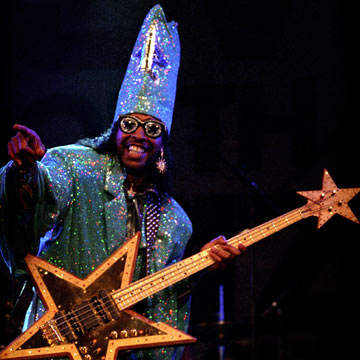

# funcadelic.js

[](https://badge.fury.io/js/funcadelic)
[](https://travis-ci.org/cowboyd/funcadelic.js)

The Fundamentals of Functional Programming are Fun!

`funcadelic` takes the simple idea that a single function can operate on many
different data structures (typeclass oriented programming) and brings
it to JavaScript. Sure, there are a lot of FP libraries out there, but
this one is geared towards unlocking the magical powers of functional
programming while always maintaining a tangible and accessible
experience for JavaScript developers. Because if you're a JavaScript
developer today, you're already using most of the structures in funcadelic!

Quick example:

``` javascript
import { map } from 'funcadelic';

function double(i) { return i * 2; }

map(double, [1,2]); //=> [2,4]
map(double, {one: 1, two: 2}) //=> {one: 2, two: 4}
```

Notice how we used a _single_ function `map` to operate on both an
`Array` and an `Object`? That's because they're both instances of
the `Functor` typeclass which has a single operation called
`map`. Look familiar? It should because `map` is something you
probably do with Arrays all the time. Funcadelic just takes
this concept and lets you make it available to _any_ data type for
which it makes sense, not just Array. And as it turns out there are
tons of them out there!

And just remember: Don't be afraid of weird names like
Semigroup, Functor, Monad, Monoid and the like! They're just arbitrary
names that describe really useful concepts. Kinda like this one.

>
> Taskulamppu
>

Looks pretty weird right? Exotic, even. It's hard to parse, so it must
be a hard concept.

Turns out it's the [Finnish word for
flashlight](http://en.bab.la/dictionary/finnish-english/taskulamppu);
A strange name at first (to non-finnish ears) for a very useful and
easily understood tool.

## Type Classes

These typeclasses are currently contained within funcadelic.

typeclass | instance operations
--------- | -------------------
[`Semigroup`](#semigroup) | [`append(a, b)`](#appenda-b)
[`Monoid`](#monoid) | [`reduce(Monoid, list)`](#reducemonoid-list)
[`Functor`](#functor) | [`map(fn, functor)`](#mapfn-functor)
[`Applicative`](#applicative) | [`apply(Applicative, fn, list)`](#applyapplicative-fn-list) <br> [`pure(Applicitave, value)`](#pureapplicative-value)
[`Monad`](#monad) | [`flatMap(fn, monad)`](#flatmapfn-monad)
[`Foldable`](#foldable) | [`foldl(fn, initial, foldable)`](#foldlfn-initial-foldable) <br> [`foldr(fn, initial, foldable)`](#foldrfn-initial-foldable)

### Semigroup

A semi group is fancy name isn't it? It's just a data structure that
can be "mashed" together with itself. Instead of `Semigroup`, you
could call it `MashableTogetherableWithItselfable`, but that's a lot
to say every time. You mash two items in a `Semigroup` together with
the `append` function.

#### append(a, b)

> Combine two members of a semigroup into a single value of the same
> semigroup.

Arrays are classic example of `Semigroup`. What do you get when you
mash two arrays together? Well another array of course! `Array + Array
=> Array`

``` javascript
import { append } from 'funcadelic';

append([1,2], [3,4]) //=> [1,2,3,4]

```

But arrays aren't the only things that can be mashed together. Objects
can too!

``` javascript
append({name: 'Charles'}, {occupation: 'Developer'}) //=> {name: 'Charles', occupation: 'Developer'}
```

When you smush two members of a semigroup together, you always get the
same type back. In that example above: `Object + Object => Object`

### Monoid

Monoids take the concept of [`Semigroup`](#semigroup) and extend it just _teeeeeny
weeeny_ bit further so that you can use the `append` operation to fold
any list of monoids really easily into a single value.

#### reduce(Monoid, list)

> Fold a list of monoids into a single value by smushing them
> together, starting with an empty value.

For example, a thing you see often is merging a list of objects together to produce
a single object with all of the keys and values.

``` javascript
let name = {name: 'Charles'}
let occupation = {occupation: 'Developer'}
let height = {height: {unit: 'cm', amount: 200}}
```

In order to produce this single merged value you might use
`Array.prototype.reduce`

``` javascript
[name, occupation, height].reduce((accumulator, object) => append(accumulator, object), {})
```

Here we start with an initial value of our accumulator (an empty
object) and successively `append` each object to it to produce the
final object.

But if you know for certain what your start state is (`{}`), and how to
combine any two objects (`append`), then you don't actually need to bother
with writing your reduce, you can just use a monoidal reduction where
those operations are implicit:

``` javascript
reduce(Object, [name, occupation, height])
//=> {name: 'Charles', occupation: 'Developer', height: {unit: 'cm', amount: 200}}
```

Of course, you may have recognized this as something akin to using
[`Object.assign`](https://developer.mozilla.org/en-US/docs/Web/JavaScript/Reference/Global_Objects/Object/assign),
with an empty object:

``` javascript
Object.assign({}, name, occupation, height);
```

The only difference is that it's not treating it as a unique,
snowflake of an interface, but instead acknowledging it for what it is:
_the same fundamental operation as array concatenation and string
concatenation_ (to name just a few)

Oh, and surprise, suprise! Arrays are Monoids as well....

``` javascript
reduce(Array, [[1,2], [3,4]]) //=> [1,2,3,4]
```

Some types, like numbers have many ways that they could be
reduced. You could add them or multiply them just to name two. For these cases,
funcadelic provides you a helper `Monoid.create`

``` javascript
const Sum = Monoid.create(class {
  empty() { return 0; }
  append(a, b) { return a + b; }
})

Sum.reduce([1,2,3,4]) //=> 10

const Multiplication = Monoid.create(class {
  empty() { return 1; }
  append(a, b) { return a * b; }
})

Multiplication.reduce([1,2,3,4]) //=> 24
```

### Functor

I used to think that Functor was some strange amalgamation of the words
"Function" and "Constructor". I don't think that any more because it
isn't true, although I still have yet to find a satisfying origin for
that word.

Nowadays, it's enough for me to reflect upon the fact that if George
Clinton were running an empire, instead of calling the provincial
governors "Satraps", he would have probably called them "Functors".



Once you give up hope on trying to understand the etymology of the
word "Functor", you can focus on the idea that it represents some
kind of "container" or "context" with its own intrinsic structure
separate from the things that it contains. Using the `map` function,
you can swap out the values in a container without changing the
structure of the container itself.

#### map(fn, functor)

> Create a new Functor by appplying the function `fn` to the content
> of `functor`. The structure of the output Functor exactly matches
> that of the input.

Arrays are once again a classic example of Functors. You can use `map`
to change the values in an array without changing the structure of the
array itself:

``` javascript
import { map } from 'funcadelic';

map(i => i * 2, [1,2]); //=> [2,4]
```

The key here is that structure of the Array doesn't change. The input
to `map` is an array of two elements, therefore the output of `map`
_must be an array of two elements_. The content of that two element
array has changed, but the structure has not.

And guess what? Objects, are also Functors! you can map over
them too. When you map over an object, you change the value associated
with each key, but _the keys present remain the same_.

``` javascript
map(i => i * 2, {one: 1, two: 2}); //=> {one: 2, two: 4}
```

Again, notice how `map` preserves the structure of the object, even
though the values change. Both the input and the output are objects of
two keys "one" and "two"

## Applicative

[Functors](#functor) let you map a function with a single argument across a single
Functor. But what do you do if you have a function with _multiple_
arguments? Applicatives to the rescue.

#### apply(Applicative, fn, list)

> Given `list` of functors each of which holds a value, call `fn`
> using the values held in `list` as the arguments.

Let's say for example that I have a function `greet` that
takes three arguments:

``` javascript
function greet(say, to, excited) {
  return `${say}, ${to}${excited ? '!!' : '.'}`;
}

greet('Hello', 'Charles', false); //=> "Hello, Charles."
greet('Hello', 'Friend', true); //=> "Hello, Friend!!"
```

That's great if we are using literal values, but what if we're
fetching them over the network?

``` javascript
let say = $.get('/greeting'); //=> Promise([pending])
let to = $.get('/entity'); //=> Promise([pending])
let isExcited = $.get('/excitement-level'); //=> Promise([pending])
```

We could do this manually:

``` javascript
Promise.all([say, to, isExcited])
  .then(([sayResult, toResult, isExcitedResult]) => greet(sayResult, toResult, isExcitedResult))
```

Of course, this obfuscates our original intent to call `greet` with the
values in the promises. Instead, the actual greeting happens as
the very last thing in a rightward drift! It's ugly, and I don't
appreciate it.

What if we could just apply the `greet` function almost like using the
builtin [`Function.apply`][1]? like:

``` javascript
greet.apply(null, [say, to, isExcited]);
```

That would be awesome right? Well with instances of `Applicative` like
`Promise`, you totally can!

``` javascript
import { apply } from 'funcadelic';

apply(Promise, greet, [say, to, isExcited]);
```

This says: take these three promises, use the values that
they contain as the three arguments to `greet`, and then return a
promise containing the result. Nifty!

#### pure(Applicative, value)

> Take `value` and place it into the minimum possible context of applicative
> `Applicative`


Are you tired of hearing about Functors? Well too bad! Because we're going to
talk about them some more.

So anyway, what is a Functor really?  🤔

One way to think about it is that it represents a _context_. It could
be the context of being in a sequence like an array. Or it could be
the context of something that will happen in the future like a
`Promise`. Whatever the context, how do you get a value into it?

Let's look at a couple of contexts that we know like `Array` and
`Promise`. How would we get the value `"Hello My Friend-o"` into each
of these contexts? Well, what does `"Hello My Friend-o"` look like as
an Array. How about `["Hello My Friend-o"]`? That works. We did the
smallest thing we could possibly to take the value and put it into the
context of an array.

What's the smallest amount of work that we could do and put that value
into a `Promise`? The answer is.............

``` javascript
Promise.resolve("Hello My Friend-o");
```

And in fact, both of these techniques, though seemingly different
really just the same thing: taking a value and putting into the
smallest possible or "purest" context that you can. That's what pure
is all about:

``` javascript
pure(Array, "Hello My Friend-o") //=> ["Hello My Friend-o"]
pure(Promise, "Hello My Friend-o") //=> Promise {<resolved>: "Hello My Friend-o"}
```

By contrast, the Array
`["Hello My Friend-o", "Hey what's this!!! How the heck did this get in here?"]`
is an example of something that is _not_ the purest array context for
`"Hello My Friend-o"`.

### Monad

Monads are a tad controversial, yes? I think that this might well be
because we try to come at them without a full appreciation and
understanding of Functors first, and it turns out that that's just
silly! So if you don't feel completely comfortable with Functors, I
recommend you go [read up on them](#Functor) first, then work with
them a little bit and then come back here when you've got your head
fully inside and around them. Because the simple fact is that Monad's
just aren't going to make much sense unless you understand Functor
first.

So if you need to go back and learn Functor's first, go for it!
Monad's will still be waiting for you right here when you get back. It
might take 2 hours, two weeks, or two years.

Ok.

The basic `Functor` method `map` lets you transform values, but not
the enclosing context. In many ways that's the power of
mapping. You're freed from thinking of the context because it remains
constant. If you map an Array of 10 elements the result will also have
10 elements. If you map a Promise that resolves at 5:15pm and 3
seconds, the result will also resolve at 5:15pm and 3 seconds.

But sometimes that's not enough. Sometimes you want to change the
structure of the Array, or change the timing of the Promise. To unlock
this power, you need `Monad`.

Unlike `map`, the `flatMap` method of the `Monad` type class
lets you actually _modify_ the context. So you can do things like
generate an Array of a different length than the original, or generate
a Promise that resolves at a different time than the original.

Whereas `map` takes a function that converts a value into another
value, `flatMap` takes a function that converts a value into a new
value __in a new context_. It then takes that new context and combines
it in some way with the existing context. Of course what "combine"
means is up to the specific Monad.

#### flatMap(fn, monad)

> Create a new Monad by applying the function `fn` to the content
> of `monad`. `fn` is expected to return a new monadic context which is
> then "flattened" into the original context.

What does this look like? Well, here's a monad that you use all the
time, but might not know it: Promise.

Have you ever returned a new Promise from within a `Promise#then`?
Well if you have, then you're already well versed in monadic
operations because that's exactly the kind of thing you would do with
a `flatMap`.

``` javascript
let user = $.get('/');

flatMap(user => $.get(`/wingdings/`${user.wingdingId}`))
  .then(wingding => console.log(wingding));
```

Notice how the flat mapping function takes the value contained within
the Promise, but then returns a completely new promise. That's how
`flatMap` allows you to actually change the context.

### Foldable

[Functors](#functor) are all about changing the values contained within a
structure while at the same time preserving the shape of the structure
itself. When we map an array of 10 items, you get an array of 10
items.

Foldable structures are ones where you can consider all of the values it
contains and use them to compute a single value. You may have heard of
this before if you're familiar with OO design patterns as "visiting".
You have a visitor that is passed each value in the collection, and
then updates an accumulated value it maintains. Once the visitor has
visited every value, the final accumulated value is your result.

Foldable is the same way, Starting with an initial value, you "visit"
each piece of data inside of a structure, and then incorporate it into
the final value. For many `Foldables` [there is a
difference](#right-vs-left) between folding from "left" and folding
from the "right", although much of the time you don't need to consider
this.

#### foldl(fn, initial, foldable)

> Compute a single value, starting with `initial` from all of the
> values contained within `foldable` by applying `fn` to each element
> it contains starting with the "left most" value. For a discussion of
> "left most" see [Right vs Left](#right-vs-left)

For each element in `foldable`, `fn` is called with an accumulator
value (memo) and the element. The result of this call becomes the new
value for the memo. After all elements have been been folded in this way,
the final value of the memo is the return value of the fold.

Let's turn to our workhorse friend the Array for a great example of
`Foldable` that's worth a thousand words.

``` javascript
import { foldl } from 'funcadelic';

foldl((sum, i) => sum + i, 0, [1,2,3,4]) //=> 10
foldl((sum, i) => sum - i, 0, [1,2,3,4]) //=> -10
```

If this looks familiar, it is. Folding is exactly what happens when
you use
[`Array.prototype.reduce`](https://developer.mozilla.org/en-US/docs/Web/JavaScript/Reference/Global_Objects/Array/Reduce)

#### foldr(fn, initial, foldable)

> Compute a single value, starting with `initial` from all of the
> values contained within `foldable` by applying `fn` to each element
> it contains starting with the "right most" value. For a discussion of
> "right most" see [Right vs Left](#right-vs-left)

For each element in `foldable`, `fn` is called with an accumulator
value (memo) and the element. The result of this call becomes the new
value for the memo. After all elements have been been folded in this way,
the final value of the memo is the return value of the fold.

Like our friend `foldl`, Array gives a great demonstration of `foldr`.

``` javascript
import { foldr } from 'funcadelic';

foldr((sum, i) => sum + i, 0, [1,2,3,4]) //=> 10
foldr((sum, i) => sum - i, 0, [1,2,3,4]) //=> -10
```

In this case, `foldr` is roughly equivalent to
[`Array.prototype.reduceRight`](https://developer.mozilla.org/en-US/docs/Web/JavaScript/Reference/Global_Objects/Array/ReduceRight)

##### Right vs Left

What "right" and "left" means is a bit mushy and varies from Foldable
to Foldable. In an array it means starting from the first value and
ending with the last and vice-versa.

In a tree structure, it might be the difference between starting with
the leaf nodes instead of starting with the root and moving downward.

For the most part, you can ignore the difference in a language like
JavaScript with eager evaluation. It's a pretty advanced topic, and if
you find yourself coming up against problems and wondering which to
use and this documentation doesn't help. Shoot me a line and we can
talk it over about how to improve it. When in doubt, `foldl`.

## Development

```
$ yarn
$ yarn test
```

[1]: https://developer.mozilla.org/en-US/docs/Web/JavaScript/Reference/Global_Objects/Function/apply
